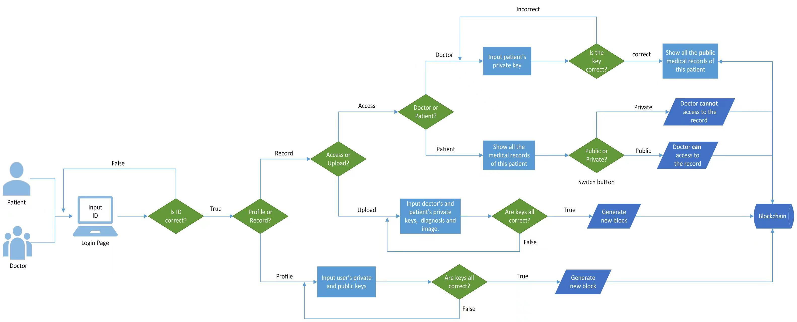

# FTEC5520: Blockchain-based Medical Record System

## Description
MedChain is a secure and immutable medical record system designed to leverage the strengths of blockchain technology. By providing a platform for patients and doctors to access and create medical records, MedChain ensures privacy and security through encrypted transactions. The system logs every change to create an immutable history of medical records. Developed using Streamlit and Flask in Python, MedChain utilizes a proof of work algorithm for block mining.

## Demo
[](https://youtu.be/dpccWB9sa7c "demo")


## Features
- **Patient and Doctor Access**: Two user roles with the ability to view and create medical records.
- **Blockchain Support**: Records are maintained in a blockchain, ensuring immutability.
- **Privacy and Security**: Each transaction is encrypted, safeguarding personal data.
- **Proof of Work**: Secure block mining process to validate transactions.
- **Immutable Record**: Each change is recorded, creating a tamper-evident log.

## Architecture


## Installation
Detailed steps to install and configure the MedChain system.
```
pip install flask streamlit requests st-pages

# New terminal to run Frontend
streamlit run Homepage.py

New terminal to run Backend
python server.py
```
